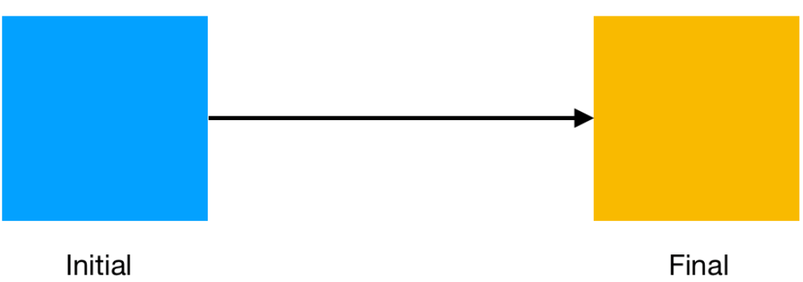

Flutter 是一个多用途的移动应用开发框架，为开发人员配备了强大的工具来创建高质量和高性能的应用程序。它的一个突出特点是对动画的强大支持，这可以使得应用程序的用户界面在视觉上更具吸引力和交互性。

### Flutter 都有哪些动画

在动画领域，Flutter 提供了一系列的能力，包括基于物理特性的动画，让动画可以模仿现实世界的动态，在你的应用程序中创造出更逼真和自然的运动。

这篇文章会宽泛略带深度的探讨 Flutter 的动画，探索各种类型并展示如何在你的项目中实施它们。

#### 你需要了解

- Dart
- Flutter

不了解Dart没法理解实例代码，不了解Flutter不知道如何触发动画。所以，这两项是必须要了解的。

### 常用的 Flutter 动画

Flutter 的动画系统围绕着“动画对象”这一概念，即一个随时间演变的值。这种演变由“动画控制器”控制，它定义了动画的持续时间、方向和其他参数。要设置一个动画，必须将这两个元素连接起来。

#### 常用的动画类

以下是在 Flutter 中创建动画时经常使用的一些关键类：

- Tween（补间）：补间类定义了一个动画要在其间进行插值的数值范围。例如，它可以指定动画的起始值和结束值。
- AnimationController（动画控制器）：这个类控制动画过程。它允许你启动、停止和重新启动动画，以及配置动画的持续时间和曲线。
- AnimatedBuilder（动画构建器）：只要动画发生变化，这个小部件就会自行重建。它在构建涉及多个小部件的复杂动画时特别有用。
- Curve（曲线）：曲线决定了动画的进展速度。Flutter 提供了如线性进度指示器和 Curves.easeInOut 这样的内置曲线，或者你也可以设计自己的自定义曲线。

##### Tween(补间动画）

这个动画是Flutter的基本动画。补间动画，顾名思义了就是在两个值之间插值，然后让一个widget动起来。如下图：


初始的状态是我们有一个背景色为蓝色的方形的widget，现在要最终让这个widget变为橘色。突然间的变色会让这个过程看起来很突兀，现在要突出丝滑的变色过程。显然，这个变色的过程如果需要开发者手动
一帧一帧的设置颜色是不现实的。这个情况下，我们可以使用`ColorTween`，这个类会提供两个蓝色和橘色之间的色值，这样整个动画过程就可以实现了。

简而言之，一个补间动画会提供两个值之间的中间值，变化过程的中间值。比如：色值、整数值、位置等几乎所有属性。
这个值不需要开发者提供，补间动画本身可以提供这些值，比如上文提到过的`ColorTween`，
我们也可以自己定义`Tween<T>`。同时，动画控制器还可以控制动画是否重复：`controller.repeat()`。

##### 动画控制器

动画控制器，顾名思义，用来控制动画的触发、过程和停止的。

然而，动画控制器的主要用处驱动动画。也就是说它会计算动画动作的下一个值，让动画在定义的范围内动起来。每个Flutter动画都至少需要
两个基本组成：
1. 一个动画可以生成值的范围（Tween）
2. 一个动画控制器

总结，就是Flutter动画至少需要一个`Tween`和一个`AnimationController`。

**注意**：动画控制器用完了要销毁！
```dart
  @override
  void dispose() {
    _controller.dispose();
    super.dispose();
  }
}
```

现在你对Flutter动画有一些基本的了解了，现在可以新建一个自己的动画了。

```dart
import 'package:flutter/material.dart';

class TweenAnimationPage extends StatefulWidget {
  const TweenAnimationPage({super.key});

  @override
  State<StatefulWidget> createState() => _TweenAnimationPageState();
}

class _TweenAnimationPageState extends State<TweenAnimationPage>
    with SingleTickerProviderStateMixin {
  late AnimationController _controller;
  late Animation<double> _animation;

  @override
  void initState() {
    super.initState();

    _controller =
        AnimationController(duration: const Duration(seconds: 2), vsync: this);
    _animation = Tween<double>(begin: 0, end: 1).animate(_controller)
      ..addListener(() {
        setState(() {});
      });

    _controller.repeat(reverse: true);
  }

  @override
  Widget build(BuildContext context) {
    return Scaffold(
      appBar: AppBar(
        title: const Text("Tween Animation"),
      ),
      body: Center(
        child: Opacity(
            opacity: _animation.value, child: const Text("Tween Animation")),
      ),
    );
  }

  @override
  void dispose() {
    _controller.dispose();
    super.dispose();
  }
}
```


### 基于物理特性的动画

Flutter 提供了模拟类用于创建具有初始状态和演化规则的基于物理的模拟。这个类使你能够创建各种各样基于物理的动画，包括那些基于弹簧动力学、摩擦力和重力的动画。

让我们考虑一个在 Flutter 中基于物理的动画的例子：弹簧动画。可以使用弹簧模拟类来创建这个动画，模拟一个阻尼简谐振荡器。以下是你如何使用弹簧模拟来产生一个类似弹簧的动画：

```dart
// Import required packages
import 'package:flutter/material.dart';

// Define a SpringAnimation widget
class SpringAnimation extends StatefulWidget {
  const SpringAnimation({Key? key});

  @override
  _SpringAnimationState createState() => _SpringAnimationState();
}

class _SpringAnimationState extends State<SpringAnimation> with SingleTickerProviderStateMixin {
  late final AnimationController _controller = AnimationController(
    vsync: this,
    duration: const Duration(seconds: 3),
  )..forward();

  late final Animation<double> _animation = Tween<double>(
    begin: 0,
    end: 400,
  ).animate(CurvedAnimation(
    parent: _controller,
    curve: Curves.elasticOut,
  ));

  void _startAnimation() {
    _controller.reset();
    _controller.forward();
  }

  @override
  Widget build(BuildContext context) {
    return MaterialApp(
      home: Scaffold(
        body: Center(
          child: AnimatedBuilder(
            animation: _animation,
            builder: (context, child) {
              return Stack(
                children: [
                  Positioned(
                    left: 70,
                    top: _animation.value,
                    child: child!,
                  )
                ],
              );
            },
            child: GestureDetector(
              onTap: () {
                _startAnimation();
              },
              child: Container(
                height: 100,
                width: 250,
                decoration: BoxDecoration(
                  color: const Color(0xFF00EF3C),
                  borderRadius: BorderRadius.circular(10),
                ),
                child: const Center(
                    child: Text(
                  'SEMAPHORE',
                  style: TextStyle(fontSize: 40, fontWeight: FontWeight.bold),
                )),
              ),
            ),
          ),
        ),
      ),
    );
  }

  @override
  void dispose() {
    _controller.dispose();
    super.dispose();
  }
}
```

在这个例子中，`SpringAnimation` widget 使用一个`AnimationController`来驱动动画对象。一个补间动画（Tween)定义了动画的值范围，一个带有`Curves.elasticOut` 的`CurveAnimation`为动画赋予了一个类似弹性的缓动曲线。`AnimatedBuilder` widget 被用来根据动画的值来为一个容器 widget 的位置进行动画处理。`Positioned` widget 确保容器 widget 在屏幕上的位置与动画的值相关。当 widget 被构建时，`AnimationController`启动动画对象的值的动画，从而推动容器 widget 的位置动画。


结果是一个迷人的类似弹簧的动画，在屏幕上产生一个弹跳效果。从本质上讲，基于物理的动画为你提供了一个强大的机制，用于在你的应用程序中创造逼真和流畅的运动，而 Flutter 提供了一系列的工具和类来促进它们的实现。

### 英雄动画

Flutter 中的 Hero 小部件充当不同屏幕之间共享元素过渡的渠道。例如，Hero 小部件可以对一个小部件从一个屏幕到另一个屏幕的过渡进行动画处理，包括图像、文本甚至容器等各种元素。这个小部件通过对共享元素进行动画处理来促进无缝过渡。

Hero 小部件的一个关键方面是在起始屏幕和目标屏幕上都需要相同的标签。这个标签在识别正在进行过渡的共享元素方面至关重要。

考虑以下示例，该示例说明了如何利用 Hero 小部件在图像的缩略图和全屏视图之间实现平稳过渡。

#### 缩略图页

```dart
import 'package:flutter/material.dart';

class ThumbnailScreen extends StatelessWidget {
  const ThumbnailScreen({super.key});

  @override
  Widget build(BuildContext context) {
    return Scaffold(
      appBar: AppBar(
        title: const Text('Thumbnail Screen'),
      ),
      body: Column(
        children: [
          GridView.count(
            crossAxisSpacing: 15,
            crossAxisCount: 2,
            children: [
              Hero(
                tag: 'image1',
                child: GestureDetector(
                  onTap: () {
                    Navigator.push(
                      context,
                      MaterialPageRoute(
                        builder: (context) => const FullScreenScreen(
                           imageAsset: 'assets/white_puma.jpg',
                          heroTag: 'image1',
                        ),
                      ),
                    );
                  },
                  child: Image.asset('assets/white_puma.jpg'),
                ),
              ),
              Hero(
                tag: 'image2',
                child: GestureDetector(
                  onTap: () {
                    Navigator.push(
                      context,
                      MaterialPageRoute(
                        builder: (context) => const FullScreenScreen(
                          imageAsset: 'assets/red_nike.jpg',
                          heroTag: 'image2',
                        ),
                      ),
                    );
                  },
                  child: Image.asset('assets/red_nike.jpg',
                  ),
                ),
              ),
            ],
          ),
        ],
      ),
    );
  }
}
```

#### 详情页

```dart
class FullScreenScreen extends StatelessWidget {
  final String imageAsset;
  final String heroTag;

  const FullScreenScreen({super.key, required this.imageAsset, required this.heroTag});
  @override
  Widget build(BuildContext context) {
    return Scaffold(
      body: GestureDetector(
        onTap: () {
          Navigator.pop(context);
        },
        child: Hero(
          tag: heroTag,
          child: Image.asset(imageAsset),
        ),
      ),
    );
  }
}
```

在`ThumbnailScreen`中，Hero widget 封装了图像 widget，每个都有一个独特的标签来区分共享元素。当用户与一个图像交互时，一个导航操作将他们引导到`FullScreenScreen`。

在`FullScreenScreen`中，图像被另一个 Hero widget 包裹，该 widget 具有与`ThumbnailScreen`中相应图像相同的标签。这个标签在图像从缩略图屏幕过渡到全屏显示时引导动画。此外，图像嵌套在一个手势探测器内，使用户能够在屏幕上的任何地方点击以返回到缩略图屏幕。


当用户在缩略图屏幕上点击一个图像时，Flutter 精心安排一个动画，将共享元素传送到全屏屏幕。在全屏屏幕中点击图像时，Flutter 进行一个动画，将共享元素返回到缩略图屏幕。Hero 小部件在实现屏幕之间无缝且迷人的过渡方面被证明是非常宝贵的，它在增强电子商务应用中的用户体验方面尤其有效。

### 隐性动画

隐式动画是在 Flutter 中生成响应小部件属性变化的简单动画的宝贵工具。隐式动画无需深入研究复杂的动画控制器和补间，使您能够为小部件的属性设置动画，而无需操心动画的复杂细节。隐式动画工具的一个主要例子是 AnimatedContainer 小部件。

AnimatedContainer 小部件类似于标准容器，但它具有额外的动画能力。它对诸如大小、颜色和形状等属性的变化进行动画处理。让我们来探讨一个示例，说明使用 AnimatedContainer 小部件在按下按钮时对颜色变化进行动画处理。

#### 隐性动画示例

```dart
// Import required packages and libraries
import 'package:flutter/material.dart';

// Define the ImplicitAnimations widget
class ImplicitAnimations extends StatefulWidget {
  const ImplicitAnimations({Key? key}) : super(key: key);
  @override
  createState() => ImplicitAnimationsState();
}

class ImplicitAnimationsState extends State<ImplicitAnimations> {
  bool _isPressed = false;

  void _togglePressed() {
    setState(() {
      _isPressed = !_isPressed;
    });
  }

  @override
  Widget build(BuildContext context) {
    return MaterialApp(
      home: Scaffold(
        appBar: AppBar(
          title: const Text('Color and Position Change'),
        ),
        body: Center(
          child: Column(
            mainAxisAlignment: MainAxisAlignment.center,
            children: [
              AnimatedContainer(
                duration: const Duration(seconds: 1),
                height: 200.0,
                width: 200.0,
                margin: EdgeInsets.only(
                  top: _isPressed ? 70.0 : 0.0,
                ),
                decoration: BoxDecoration(
                  color: _isPressed ? Colors.blue : Colors.red,
                  borderRadius: BorderRadius.circular(_isPressed ? 50.0 : 0.0),
                ),
              ),
              const SizedBox(height: 20.0),
              ElevatedButton(
                onPressed: _togglePressed,
                child: const Text('ANIMATE'),
              ),
            ],
          ),
        ),
      ),
    );
  }
}
```

在这个例子中，隐式动画小部件包含一个\_isPressed 布尔变量和一个\_togglePressed()函数来切换它的值。小部件的状态类在\_togglePressed()中具有一个 setState()调用，以便在值改变时触发小部件树的重新构建。

小部件的结构围绕着一个位于脚手架内的中心小部件。这个中心小部件容纳了一个包含两个主要元素的列：

- 动画容器：这个小部件根据\_isPressed 值对其属性进行动画处理。在这个例子中，高度、宽度、边距、颜色和圆角的变化会被动画化。
- 凸起按钮：这个按钮在被按下时启动动画，调用\_togglePressed()函数来切换\_is pressed。

隐式动画是一种将动画引入到你的 Flutter 应用程序的用户友好型方法，无需动画控制器和补间的复杂性。


### 动画矢量图形

Flutter 通过不同工具对动画矢量图形的支持，进一步体现了其创建复杂和动态动画的能力。基于矢量的图形在调整大小时能保持其质量。Flutter 使用不同工具来创建动画并将其导入到应用程序中。

#### Rive

Rive 提供了一种创建可跨平台部署的动画的途径，从移动端到网络端。Rive 动画被导出为 Rive 文件，这些文件可以通过 Rive 包集成到你的 Flutter 项目中。这个包还提供了一个 Rive 小部件来在你的应用程序中展示 Rive 动画。

让我们深入研究在 Flutter 应用程序中实现 Rive 的过程：

```dart
// Import required packages and libraries
import 'package:flutter/material.dart';
import 'package:rive/rive.dart';

// Define the RiveAnimations widget
class RiveAnimations extends StatelessWidget {
  const RiveAnimations({Key? key}) : super(key: key);
  @override
  Widget build(BuildContext context) {
    return Scaffold(
      backgroundColor: Colors.grey,
      body: Center(
        child: Container(
          decoration: BoxDecoration(
            borderRadius: BorderRadius.circular(20),
            color: Colors.blue,
          ),
          width: 300,
          height: 300,
          child: const RiveAnimation.asset('assets/ball.riv'),
        ),
      ),
    );
  }
}
```

要在你的 Flutter 动画中使用 Rive 加入动画矢量图形，请遵循以下步骤：

1. 使用 Rive 网站创建动画并以适当格式下载它。
2. 将 Rive 包导入到你的 Flutter 项目中。
3. 使用 RiveAnimation.asset 小部件，并提供你的 Rive 文件的路径。

可以使用 RiveAnimationController 类来控制动画，使你能够根据需要启动、停止和暂停动画。


上面的这个动画是在 Rive 中制作的，用于展示一个球被弹起和踢动，但它并没有描绘出 Rive 的所有属性。Rive 可用于为你的动画设置不同的状态，这使得你的动画在使用时更具动态性。你可以让动画对你应用程序中的状态做出反应，但你必须擅长动画才能利用 Rive 的这一方面。除了 Rive，你还可以探索像 Lottie 这样的其他工具，以便将预构建的动画整合到你的 Flutter 应用程序中。

#### Lottie 动画

Lottie 是一个受欢迎的库，它使你能够使用通过像 Adobe After Effects 这样的动画工具生成的 JSON 文件在你的应用程序中渲染动画。Lottie 动画是基于矢量的，提供了流畅和高质量的视觉体验。在 Flutter 中，你可以使用 Lottie 包来集成 Lottie 动画，该包提供了 Lottie.asset 和 Lottie.network 小部件。

以下是一个关于如何在 Flutter 中创建 Lottie 动画的例子：

```dart
// Import required packages and libraries
import 'package:flutter/material.dart';
import 'package:lottie/lottie.dart';

// Define the LottieAnimations widget
class LottieAnimations extends StatelessWidget {
  const LottieAnimations({Key? key});

  @override
  Widget build(BuildContext context) {
    return Scaffold(
      body: Center(
        child: Column(
          mainAxisAlignment: MainAxisAlignment.center,
          children: [
            const SizedBox(height: 50),
            SizedBox(
              height: 200,
              width: 200,
              child: LottieBuilder.asset('assets/shopping.json'),
            ),
            const SizedBox(height: 50),
            const Text(
              'add items to cart',
              style: TextStyle(fontSize: 30),
            ),
          ],
        ),
      ),
    );
  }
}
```

Lottie 动画能轻松让你的应用生动起来。只需找到或创建一个所需的 Lottie 格式（JSON）的动画，导入 Lottie 包，然后使用提供的小部件在你的 Flutter 应用中展示你的动画。


### 总结一下

动画在移动应用开发中起着关键作用，通过为应用注入活力和吸引力来增强用户体验。本文深入探讨了 Flutter 的动画能力，从其动画系统和基本类到基于物理的动画、自定义动画以及使用 Hero 小部件的高级动画过渡等先进技术。我们还讨论了隐式动画以及使用 Rive 和 Lottie 等包集成动画矢量图形。

通过利用这些资源，你可以进一步深入高级 Flutter 动画的世界，打造迷人且动态的用户界面，使你的移动应用脱颖而出。